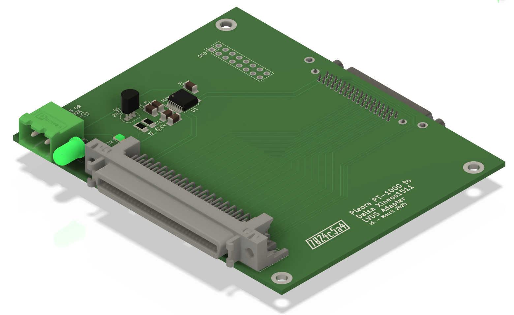

# Xineos1511LVDS-PleoraPT1000

This circuit maps the IO (LVDS and UART) of the Teledyne Dalsa Xineos-1511 CMOS detector panel to the Pleora iPORT PT1000-LV frame grabber, allowing the LVDS version of the Dalsa detector with its antiquated 68 pin VHDCI connector to be used as a more accessible GigE sensor without losing key functionality. The PCB features a UART to RS-232 level translator based on the MAX3221, as the Xineos is controlled by TTL-level serial and the PT1000 communicates at RS-232 levels.

The PCB is designed to fit in a [Hammond Manufacturing 1455J1201BK](https://www.hammfg.com/electronics/small-case/extruded/1455) extruded aluminum enclosure with cutouts in the end panels for the various connectors.

The PT1000 can be easily interfaced with via Pleora's eBUS Player application. eBUS Player can be used to configure the PT1000, capture images and video, and act as a serial terminal for controlling and configuring the detector. More granular or programatic control of image capture may require Pleora's proprietary SDK, which is outside the scope of this project.

## Folder Structure

- **Xineos1511LVDS-PleoraPT1000** - The repository root and main KiCAD project directory
    - **3D_Models** - Model files referenced in the KiCAD PCB
    - **Drawings** - Dimensional drawings used for the enclosure panel cutouts, etc.
    - **Images** - Reference photos and screenshots of the parts and assemblies, as well as sample captures from the detector using the adapter board described in this project.
    - **Xineos1511_LVDS_Adapter.pretty** - KiCAD PCB footprint files
    - **BOM** - Files in various formats containing the Bill of Materials needed to assemble the board, with suggested part numbers.
      
## Hardware Configuration and Assembly Notes

- The PCB is dimensioned such that it is held in place within the Hammond enclosure by the enclosure's end panels. The standoffs for the MDR and VHDCI connectors will further secure it in place.

- The MAX3221 has a VCC input pin with an acceptable range of 3.3V to 5V. If you wish to use a higher voltage supply to reduce the number of voltage sources in your application, you will need to add a regulator to the board. The current version of the PCB does not account for this, but it would be straightforward to add. The PCB has overlapping footprints for two possible configurations for power connectors for the board:
    - A Phoenix Contact pluggable terminal block, part number 1757242 (MSTBA_2,5/_2-G-5,08 MSTBA252G508)
    - A PJ-202A barrel jack, or a similar receptacle using the same footprint.

- The values of the two resistors controlling the 'RS-232 OK' LED indicator circuit (R1 and R2) will depend on nominal current draw of the LED as well as the BJT you use for Q1, should you decide to not use a 2N3904. If you use an LED that needs more or less than 20mA, or if you populate both the SMD and through-hole LED footprints, you will have to account for that with the resistors, and potentially change which transistor you use. Alternatively, if you do not need the indicator LED at all, the transistor, LEDs, R1 and R2, and the LED cutout in the front enclosure panel can be excluded entirely.

- The J4 header is optional. It was added during the debugging of the original board design, and now serves as a place to probe the serial signals, or as a interface to use external serial terminals.

- In testing, 10% tolerance for all capacitors (X7R MLCC type) in the schematic can be used without issue. Lower tolerance capacitors can be used, but there is no need to do so. All of the SMD resistors and capacitors are in the 1206 package size because I personally find it the easiest to hand-solder, but there is no reason a smaller package size couldn't be used.

- The 68-Pin MDR and VHDCI Connectors:
    - The VHDCI connector has M2x0.4mm threaded holes for standoffs. My connector did not come with any when I purchased it from eBay, so you may need to order some separately. Note that the VHDCI connector is placed on the bottom of the PCB, opposite the MDR connector and SMD components. This was done for the easiest routing of the data lines. The reference image, [Images/Board_Rear_Phoenix](Images/Board_Rear_Phoenix.png), demonstrates this the most clearly.
    - The MDR connector has M2.6x0.45 threaded holes for standoffs. These are not common and will need to be purchased separately. Alternatively, an MDR cable using the clip-style locking mechanism can be used in place of standoffs, but as of the publishing of this project, the clip-style cables are uncommon to come by in the second-hand market. The thread of the female side of the standoffs will depend on your MDR cable (e.g. #4-40, M2.6m, M2.5)
    - You will often see these cables on sites like eBay incorrectly listed as "SCSI-3" or "SCSI-5" cables. When buying a cable, ensure you know the difference between MDR and HPDB (Half-Pitch DSUB) as they are not compatible. The PT1000-LV uses MDR, so you should only use a genuine MDR connector (e.g. the DX10M-68SE(50) in the BOM) and cable with this project for ease of finding parts and having them mate correctly. During the design of the PCB, I purchased a Hirose DX10A-68S(50) connector, thinking it would work with a standard 68-pin MDR cable, but that part number is **not** intended to be MDR-compatible despite looking nearly identical, and as such I could not get it to mate without extreme force which ultimately damaged my cable. Don't make the same mistake as me- just buy the DX10M-68SE(50). The connector/cable vendor Winford has [a good document](https://www.winford.com/download/centronics_mdr_vhdci_hpdsub_connector_guide.pdf) comparing the various connector types. You can also purchase cables directly from them, but they are more expensive than the used or new-old-stock 1m or 1.5m cables that appear on eBay from time to time for $10 to $30 USD. If you are an expert at soldering, want to know the pain of soldering 136 tiny pins, or are out of your mind, you can consider purchasing the male MDR cable-mount connectors and matching housings to make your own cable. However, I recommend being patient and waiting for a pre-made cable to be available for purchase.

- The drawings for the housing's end panel cutouts located in the [Drawings directory](Drawings/) are based on the parts in the BOM. If you use different signal connectors, power receptacles, or LEDs, you will need to change the position and dimensions of the cutouts. The drawings are based on the panels in the CAD assembly from Hammond, so if you need to change the cutouts, download the assembly's STEP file from Hammond's website (linked above) and reference the end panel components to create new drawings as needed. Note that as of publishing this repository, I have not tested the accuracy of those drawings. I will update this note when I have actually used the drawings to create my own end panels, and can verify that they are accurate.

- If you want to forego the enclosure entirely or make your own, I have added mounting holes with grounded pads for M2.5 or M3 screws (loose tolerances).

## Software Configuration Notes

- Pleora iPORT PT1000-LV & eBUS Player
  
    - Pleora provides a good quick start guide. Search "eBUS Player Quick Start Guide" on your preferred search engine to find it. It has instructions for installing the software and configuring your computer's network interface to support GigE communication.
    - Depending where you purchased your PT1000-LV from, it may have non-standard OEM/customer firmware on it that prevents it from being usable with eBUS player. Pleora distributes the "iPORT Firmware Update" application for updating the PT1000's firmware over ethernet. You may need to contact Pleora support or have a Pleora Technologies account in order to download it. When run, it will discover any reachable PT1000's on your network, even if they fail to get an address from DHCP and end up with a 169.254.0.0/16 address.
    - Once the PT1000 has the correct firmware and can be reached using eBUS Player, it can be configured for the adapter and Xineos-1511 using the the three menus in the Parameters and Controls section in the main window. To configure the PT1000 for use with this adapter and the Xineos-1511 ensure the settings specified in [eBUS_Player_Config.md](eBUS_Player_Config.md) are set as specified.

- Xineos-1511
  - Once the PT1000-LV has been configured based on the previous section, you can use eBUS Player's "Device Serial Communication" menu to configure the detector over the serial link. See the Xineos-1511's user manual for a more detailed list of available commands, but the following will allow you to configure it to work with the settings in [eBUS_Player_Config.md](eBUS_Player_Config.md):

    - `stm 0` will set the detector's sync mode to free running without needing to be triggered.
    - `svm 0` sets the readout to full resolution, as opposed to region-of-interest mode.
    - `sbn 0` disables 2x2 pixel binning mode, which enables full 1488x1148 resolution.
    - `set 0` sets the number of milliseconds per frame to 0. Higher values will likely be needed depending on the exposure parameters. Framerate decreases linearly as this value is increased.
    - `sot 1` sets the black level offset to 95% of full scale. This was an acceptable default in testing.
    - `srd 0` sets the readout direction from the bottom to the top of the detector.
    - `svs 0 1` sets the image acquisition source to the image panel in high well mode. `svs 1 #` and `svs 2 #` are used for the analog and digital test patterns, respectively. See the Xineos-1511's manual for more details.

  - You may need to configure these settings differently depending on your framerate and exposure needs. Similarly, you may need to load defect maps onto the device if your images have defective pixels. In testing, a fork of the terminal application PuTTY called ExtraPuTTY was used to send and receive the maps and firmware via the XMODEM protocol that the Xineos-1511 uses for file transfers, but an exernal serial interface needed to be connected to the adapter PCB to do this, as eBUS Player's serial communication tool doesn't support XMODEM. Passthrough of the PT1000's serial interface via eBus Player to another device on the PC is also possible using a null modem emulator.

## Disclaimers

Research all devices mentioned in this project, read their datasheets and manuals thoroughly, back up your detector's FPGA image, user firmware, timing configuration, and maps before making major changes in case you need to revert. I assume no responsibility for lost configurations or catastrophic firmware damage using the setup described in this project. This project was an experimental proof-of-concept and should not be used in production environments involving patient care or product manufacturing.

The files in this repository contain no datasheets or proprietary software from Teledyne Dalsa or Pleora Technologies, and thus they will need to be obtained via licensed channels by anyone wanting to further develop this project. If you have specific questions about the design or content in this repository, feel free to contact me via issues on this repository, or via email at 7824c5a4(at)gmail.com, but *do not* contact me to request software binaries or licensed documents.

I am an amateur electronics and imaging hobbyist, so I cannot guarantee that this PCB or software configuration is optimal. It worked well enough for my purposes, but you may need to redesign the hardware or processes to suit your requirements. I am publishing this project in hopes that it enables more affordable use of second-hand detector panels and inspires more creative, custom imaging solutions.

> [!CAUTION]
> **Do not use X-ray generating equipment unless you are trained and authorized to do so, and are doing so in a controlled environment that limits exposure to harmful radiation and lethal voltages! Understand and abide by your local regulations regarding owning and operating ionizing radiation-producing equipment!**
